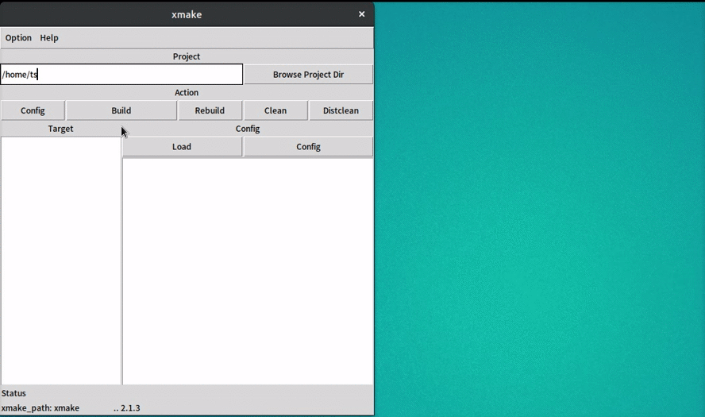

# ts-xmake-gui

[](https://www.codacy.com/app/TitanSnow/ts-xmake-gui?utm_source=github.com&utm_medium=referral&utm_content=TitanSnow/ts-xmake-gui&utm_campaign=badger)
[](https://ci.appveyor.com/project/TitanSnow/ts-xmake-gui)

An ugly xmake gui

## require

* [xmake](https://github.com/tboox/xmake) 2.1.3+ if on Windows
* better if have xterm
* python2 if not on Windows
* python-tk if not on Windows

## usage
### installation
```console
$ git clone https://github.com/TitanSnow/ts-xmake-gui.git
$ cd ts-xmake-gui
$ git submodule update --init
$ make build
$ sudo make install
```

### run
in console
```
/path/to/ts-xmake-gui$ ./ts-xmake-gui.py
/path/to/ts-xmake-gui$ python ts-xmake-gui.py              # if the previous doesn't work
/path/to/ts-xmake-gui$ /path/to/python2 ts-xmake-gui.py    # if still doesn't work
```

### For windows users
Just download the exe file from lastest release then run it

## demo

